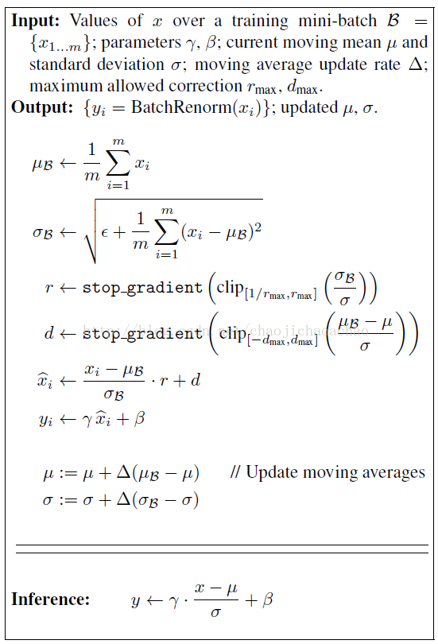

# BN及其变体

## BN

解决的问题：

1. Internal Covariate Shift

   > **Internal Covariate Shift 与 Covariate Shift**
   >
   > 是对层与层之间数值偏移的描述，`batchnorm`对数值层面做了**高斯均衡化**，而后者是迁移学习中解决原空间和目标空间边缘分布不一致的一个分支问题，是对不同空间表征的偏移的描述。

   > **Internal Covariate Shift**
   >
   > 影响在于训练过程中，参数空间变化使得学习的分布也是在变化的。这就增大了学习的难度。
   >
   > 
   >
   > 举个简单线性分类栗子，假设我们的数据分布如a所示，参数初始化一般是0均值，和较小的方差，此时拟合的$y=wx+b$如`b`图中的橘色线，经过多次迭代后，达到紫色线，此时具有很好的分类效果，但是如果我们将其归一化到0点附近，显然会加快训练速度，如此我们更进一步的通过变换拉大数据之间的相对差异性，那么就更容易区分了。
   >
   > 注：另一个原因在于，训练过程对于后一层来说，前一层的数据分布也是在变化的。更增大了训练的难度。

   > **Covariate Shift**
   >
   >

2. 算法流程：

   > 

3. 解释

   1. > 从Bayesian的角度去解释`batchnorm`，首先引出`PRML`中解释的L2-NORM的由来：
      >
      > 【似然函数*先验分布=后验分布，log(后验分布)=log(似然函数)+L2-NORM】，
      >
      > 可知在`log`域的`L2-NORM`（即先验分布）对应原值域的高斯分布，因此目标函数的拟合相当于后验分布的拟合，对weight的L2-NORM 正则项是对weight先验分布的拟合，这种拟合压制了训练中`weight`的波动，而原值域的变化不仅依赖于weight，也依赖于输入`X`，因此`batchnorm`就是一种对`X`波动的压制，从这个意义上，`batchnorm`便可解释为对`X`的正则项。这种压制其实并不是刚刚出现的，所谓白化操作就是对输入数据的`normalize`，而`batchnorm`简化了其计算。

   2. > 作者猜测`BatchNormalization`层的雅可比矩阵的奇异值接近1，这加速了模型的收敛速度。

   3. > 而scale与shift也对应着Bayesian解释，由于采用部分数据的分布作为所有数据的先验分布，其实便破坏了整个空间的原始表征，scale与shift就是在逆转对表征的破坏，逆转的程度由模型在训练中自己调整。通常将带scale和shift的BN层加在非线性激活函数之前，在`caffe`的官方版本中将bias转移到了`batchnorm`后面的scale层中。	

4. 缺点

   > 对mini-batch求统计信息，因此具有数据依赖性，数据的随机性会导致训练的不稳定，且batch=1时无法使用。而各种变体本质上就是在寻找Natural Gradient，在加速收敛的同时，保证模型的泛化能力。

## Batch-Renormalization

1. 问题

   batch norm原作者对其的优化，该方法保证了train和inference阶段的等效性，解决了非独立同分布和小minibatch的问题

2. 算法

   

   `r`和`d`首先通过minibatch计算出，但stop_gradient使得**反传中`r`和`d`不被更新**，因此r和d不被当做训练参数对待。试想如果r和d作为参数来更新，如下式所示：

   

   这样一来，就相当于在训练阶段也使用`moving averages`  $μ$和$σ$，这会引起梯度优化和normalization之间的冲突，优化的目的是通过对权重的scale和shift去适应一个minibatch，normalization则会抵消这种影响，
   而moving averages则消除了归一化后的激活对当前minibatch的依赖性，使得minibatch丧失了对每次权重更新方向的调整，从而使得权重尺度因normalization的抵消而无边界的增加却不会降低loss。而在前传中r和d的仿射变换修正了minibatch和普适样本的差异，使得该层的激活在inference阶段能得到更有泛化性的修正。

3. 

## Instance Norm

## Ada-BN

## Weight-Normalization

## IBN

