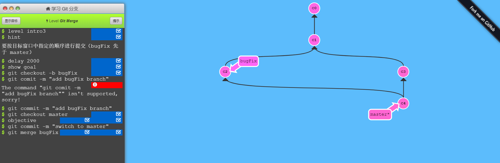

**注：** 关于常用命令环境的参考书目或者学习网站。

## linux 

- [the linux command line 中文版](http://billie66.github.io/TLCL/book/)

## Git & GitHub

- 入门 

  - 书籍推荐 《GitHub 入门与实践》
  - 在线网站 推荐 [廖雪峰老师的教程](https://www.liaoxuefeng.com/wiki/0013739516305929606dd18361248578c67b8067c8c017b000)

- 深入了解

  - [Pro Git](https://git-scm.com/book/zh/v2)

    多国语言可以任意阅读

  - [Learn Git Branching](https://learngitbranching.js.org/)

    可以到`git` 命令执行以后的 `git log graph `变化。了解`git `分支处理。

    

  - [TryGit](http://try.github.io)

    只有英文版

