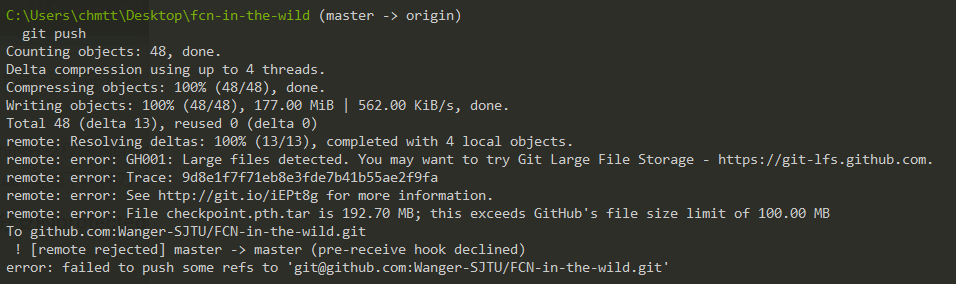

**问题描述**		



> [remote rejected] master -> master (pre-receive hook declined)
> error: failed to push some refs to 'git@github.com:Wanger-SJTU/FCN-in-the-wild.git'

**原因**

> 所push的分支权限为protected,只有项目的管理员或者项目的管理员指派的具有相应权限的人才能进行push,要进行项目的push

> 这个文件是从其他位置复制过来的，权限上存在问题。

**解决方法**

1. **将所要push的内容所在的分支的protected权限关闭**

   1. 进入所在项目的settings

      ​

   2. ​

2. **新建其它分支，将项目push到新建的分支上，后期再进行merge**

   1. 新建分支

      ```git
      git branch 分支名
      ```

   2. 切换分支

      ```
      git checkout 分支名
      ```

   3. 项目上传

      ```
      git add .

      git commit -m "提交的信息"

      git remote add origin 远程仓库地址

      git push -u origin 分支名
      ```

      ​

   4. ​