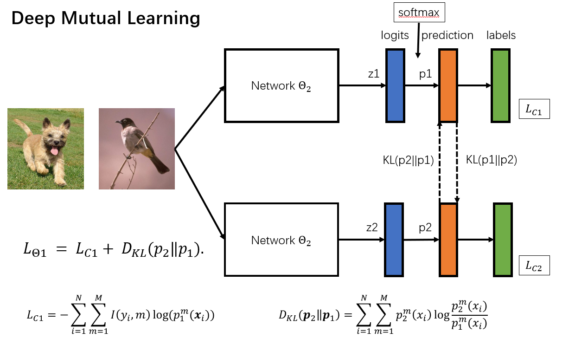

# Deep Mutual Learning

[paper](https://drive.google.com/file/d/1Deg9xXqPKAlxRgmWbggavftTvJPqJeyp/view)

[offical code in TF](https://github.com/YingZhangDUT/Deep-Mutual-Learning.git)

# Motivation

DML 和模型蒸馏的不同之处在于，DML提供了一种无需预训练网络的知识迁移。可以应用在有监督学习，多模型协同学习，半监督学习等方面。

核心之处在于，使得两个网络的预测分布趋于一致。这里采用了KL散度作为模型的分布的度量标准。作者在实验中之处，无论是不对称的KL散度还是对称的JS散度，结果相差不大。

对于分类问题，$z_1$是模型输出的logits， 经过$softmax$层以后，等到预测概率。然后计算KL散度。和交叉熵损失函数。

## 异步更新

可以看到，这里的更新策略是，先计算模型的输出概率，根据模型1的损失函数，对模型1反向传播，梯度更新以后，计算模型1的输出概率，根据模型2的损失函数对模型2进行梯度更新。直到收敛。

## 扩展

对于不同的情况，修改一下损失函数即可。

1. 多模型协同学习

   对于K个模型
   $$
   L_{\Theta_k}=L_{C_k}+\frac{1}{K-1}\sum_{l=1,l\neq k}^{K}D_{KL}(p_l\Vert p_k)
   $$

2. 半监督学习

   KL散度的计算无需标签信息，所以也可以用于半监督学习。假设监督样本和无监督样本分别为 $\mathcal{L}$ 和 $\mathcal{U}$ ,那么$\mathcal{X}=\mathcal{L}  \bigcup \mathcal{U}$

   ​
   $$
   L_{\Theta_1}=\underset{x\in \mathcal{L}}{L_{C_1}}+\underset{x\in \mathcal{X}}{D_{KL}(p_2\Vert p_1})
   $$
   ​

# 结果

通过DML，获得了更好的泛化性能。