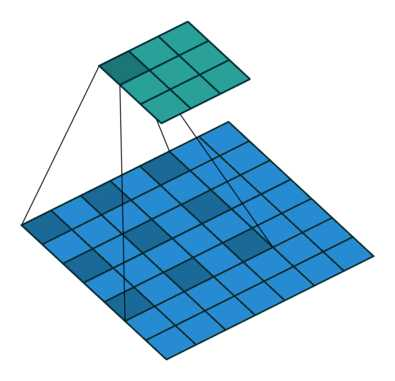

 

 

 # 语义分割中的卷积操作

[答案链接](https://www.zhihu.com/question/54149221)

最近做的工作正好也正好涉及到这个话题，我来尝试回答一下吧，这里针对 

[@谭旭](http://www.zhihu.com/people/4a4562549ff1c5af97ece0cd3be1747d)

Dilated/Atrous Convolution 或者是 Convolution with holes 从字面上就很好理解，是在标准的 convolution map 里注入空洞，以此来增加 reception field。相比原来的正常convolution，dilated convolution 多了一个 hyper-parameter 称之为 dilation rate 指的是kernel的间隔数量(e.g. 正常的 convolution 是 dilatation rate 1)。

一个简单的例子，[动态图来源：[vdumoulin/conv_arithmetic](https://link.zhihu.com/?target=https%3A//github.com/vdumoulin/conv_arithmetic)]：

Standard Convolution with a 3 x 3 kernel (and padding)

Dilated Convolution with a 3 x 3 kernel and dilation rate 2

不过光理解他的工作原理还是远远不够的，要充分理解这个概念我们得重新审视卷积本身，并去了解他背后的设计直觉。以下主要讨论 dilated convolution 在语义分割 (semantic segmentation) 的应用。

## 重新思考卷积： Rethinking Convolution

在赢得其中一届ImageNet比赛里VGG网络的文章中，他最大的贡献并不是VGG网络本身，而是他对于卷积叠加的一个巧妙观察。

> This (stack of three 3 × 3 conv layers) can be seen as imposing a regularisation on the 7 × 7 conv. filters, forcing them to have a decomposition through the 3 × 3 filters (with non-linearity injected in between).

这里意思是 7 x 7 的卷积层可以看做 3 个 3 x 3 的卷积层的叠加后的正则。而这样的设计不仅可以大幅度的减少参数，其本身带有正则性质的 convolution map 能够更容易学一个 generlisable, expressive feature space。这也是现在绝大部分基于卷积的深层网络都在用小卷积核的原因。

然而 Deep CNN 对于其他任务还有一些致命性的缺陷。较为著名的是 up-sampling 和 pooling layer 的设计。这个在 Hinton 的演讲里也一直提到过。

主要问题有：

1. Up-sampling / pooling layer (e.g. bilinear interpolation) is deterministic. (a.k.a. not learnable)
2. 内部数据结构丢失；空间层级化信息丢失。
3. 小物体信息无法重建 (假设有四个pooling layer 则 任何小于 2^4 = 16 pixel 的物体信息将理论上无法重建。)

在这样问题的存在下，语义分割问题一直处在瓶颈期无法再明显提高精度， 而 dilated convolution 的设计就良好的避免了这些问题。

## 空洞卷积的拯救之路：Dilated Convolution to the Rescue

题主提到的这篇文章 [MULTI-SCALE CONTEXT AGGREGATION BY DILATED CONVOLUTIONS](https://link.zhihu.com/?target=https%3A//arxiv.org/pdf/1511.07122.pdf) 可能(?) 是第一篇尝试用 dilated convolution 做语义分割的文章。后续图森组和 Google Brain 都对于 dilated convolution 有着更细节的讨论，推荐阅读：[Understanding Convolution for Semantic Segmentation](https://link.zhihu.com/?target=https%3A//arxiv.org/abs/1702.08502) [Rethinking Atrous Convolution for Semantic Image Segmentation](https://link.zhihu.com/?target=https%3A//arxiv.org/abs/1706.05587) 。

对于 dilated convolution， 我们已经可以发现他的优点，即内部数据结构的保留和避免使用 down-sampling 这样的特性。但是完全基于 dilated convolution 的结构如何设计则是一个新的问题。

**潜在问题 1：The Gridding Effect**

假设我们仅仅多次叠加 dilation rate 2 的 3 x 3 kernel 的话，则会出现这个问题：

我们发现我们的 kernel 并不连续，也就是并不是所有的 pixel 都用来计算了，因此这里将信息看做 checker-board 的方式会损失信息的连续性。这对 pixel-level dense prediction 的任务来说是致命的。

**潜在问题 2：Long-ranged information might be not relevant.**

我们从 dilated convolution 的设计背景来看就能推测出这样的设计是用来获取 long-ranged information。然而光采用大 dilation rate 的信息或许只对一些大物体分割有效果，而对小物体来说可能则有弊无利了。如何同时处理不同大小的物体的关系，则是设计好 dilated convolution 网络的关键。

## 通向标准化设计：Hybrid Dilated Convolution (HDC)

对于上个 section 里提到的几个问题，图森组的文章对其提出了较好的解决的方法。他们设计了一个称之为 HDC 的设计结构。

第一个特性是，叠加卷积的 dilation rate 不能有大于1的公约数。比如 [2, 4, 6] 则不是一个好的三层卷积，依然会出现 gridding effect。

第二个特性是，我们将 dilation rate 设计成 锯齿状结构，例如 [1, 2, 5, 1, 2, 5] 循环结构。

第三个特性是，我们需要满足一下这个式子： ![M_i=\max[M_{i+1}-2r_i,M_{i+1}-2(M_{i+1}-r_i),r_i]](https://www.zhihu.com/equation?tex=M_i%3D%5Cmax%5BM_%7Bi%2B1%7D-2r_i%2CM_%7Bi%2B1%7D-2%28M_%7Bi%2B1%7D-r_i%29%2Cr_i%5D)

其中   是 i 层的 dilation rate 而  是指在 i 层的最大dilation rate，那么假设总共有n层的话，默认  。假设我们应用于 kernel 为 k x k 的话，我们的目标则是  ，这样我们至少可以用 dilation rate 1 即 standard convolution 的方式来覆盖掉所有洞。

一个简单的例子:  dilation rate [1, 2, 5] with 3 x 3 kernel (可行的方案)

而这样的锯齿状本身的性质就比较好的来同时满足小物体大物体的分割要求(小 dilation rate 来关心近距离信息，大 dilation rate 来关心远距离信息)。

这样我们的卷积依然是连续的也就依然能满足VGG组观察的结论，大卷积是由小卷积的 regularisation 的 叠加。

以下的对比实验可以明显看出，一个良好设计的 dilated convolution 网络能够有效避免 gridding effect.

## 多尺度分割的另类解：Atrous Spatial Pyramid Pooling (ASPP)

在处理多尺度物体分割时，我们通常会有以下几种方式来操作：

然仅仅(在一个卷积分支网络下)使用 dilated convolution 去抓取多尺度物体是一个不正统的方法。比方说，我们用一个 HDC 的方法来获取一个大（近）车辆的信息，然而对于一个小（远）车辆的信息都不再受用。假设我们再去用小 dilated convolution 的方法重新获取小车辆的信息，则这么做非常的冗余。

基于港中文和商汤组的 PSPNet 里的 Pooling module （其网络同样获得当年的SOTA结果），ASPP 则在网络 decoder 上对于不同尺度上用不同大小的 dilation rate 来抓去多尺度信息，每个尺度则为一个独立的分支，在网络最后把他合并起来再接一个卷积层输出预测 label。这样的设计则有效避免了在 encoder 上冗余的信息的获取，直接关注与物体之间之内的相关性。

## 总结

Dilated Convolution 个人认为想法简单，直接且优雅，并取得了相当不错的效果提升。他起源于语义分割，大部分文章也用于语义分割，具体能否对其他应用有价值姑且还不知道，但确实是一个不错的探究方向。有另外的答主提到WaveNet, ByteNet 也用到了 dilated convolution 确实是一个很有趣的发现，因为本身 sequence-to-sequence learning 也是一个需要关注多尺度关系的问题。则在 sequence-to-sequence learning 如何实现，如何设计，跟分割或其他应用的关联是我们可以重新需要考虑的问题。