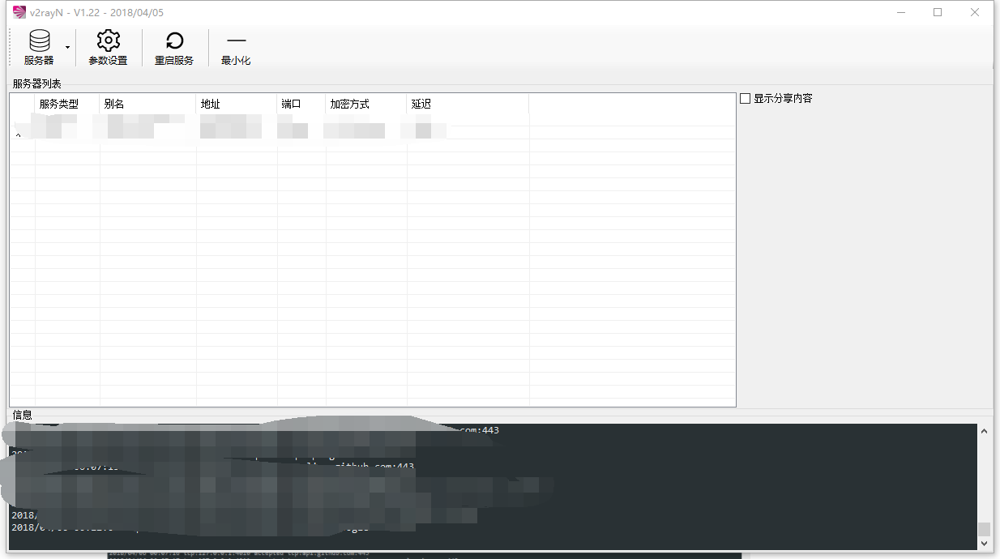
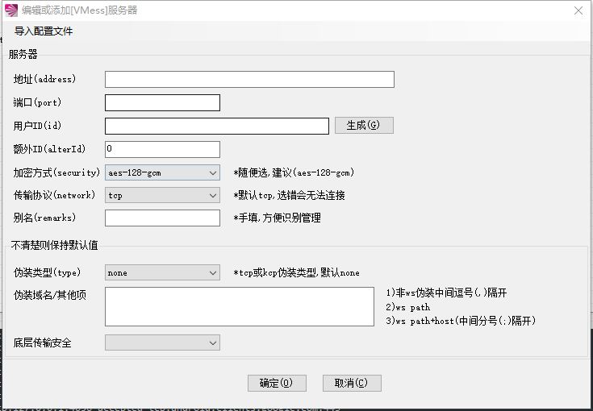

https://github.com/你的github用户名/你的项目名/raw/master/用来存储图片的文件夹/要添加的图片centos 7 安装 v2ray

### server端配置

vps要求：

- 在墙外，这没什么好说的

- Arch、Ubuntu、CentOS，Debian都支持，最好是64位系统

- 服务器时间和你本地时间误差要在一分钟之类，否则会连不上，所以需要在连接之前对服务器进行时间校对

  **服务器校时**

  ```
  yum/apt -y install ntpdate
  ntpdate time5.aliyun.com
  ```

  **查看时区**

  ```
   ls -l /etc/localtime
   //lrwxrwxrwx 1 root root 27 Jan 26 05:54 /etc/localtime -> /usr/share/zoneinfo/Etc/UTC
  ```

  **更改系统时区**

  ```
  rm -f /etc/localtime
  ln -s /usr/share/zoneinfo/Asia/Shanghai /etc/localtime
  ```

  **查看确认系统时间**

  ```
  date -R
  //Wed, 31 Jan 2018 10:00:26 +0800
  ```

  **安装ufw**

  ufw是linux下的防火墙配置工具，使用更加友好。

  ```
  yum/apt-get install ufw
  ```

  ​

  ​

### server端安装

Linux服务器下面命令基本一样。这里的安装方式跟[官方教程一样](https://www.v2ray.com/chapter_00/install.html)

`bash <(curl -L -s https://install.direct/go.sh)`

**启动服务并且查看服务状态**

```
systemctl start v2ray
systemctl status v2ray	
```

```
v2ray.service - V2Ray Service
Loaded: loaded (/etc/systemd/system/v2ray.service; enabled; vendor preset: enabled)
Active: active (running) since Wed 2018-01-31 00:32:29 UTC; 8h ago
Main PID: 2392 (v2ray)
Tasks: 7
Memory: 5.6M
CPU: 4.512s
CGroup: /system.slice/v2ray.service
└─2392 /usr/bin/v2ray/v2ray -config /etc/v2ray/config.json

Jan 31 00:32:29 instance-5 systemd[1]: Started V2Ray Service.
Jan 31 00:32:29 instance-5 v2ray[2392]: V2Ray v3.6 (die Commanderin) 20180112
Jan 31 00:32:29 instance-5 v2ray[2392]: An unified platform for anti-censorship.
```


配置文件等客户端结束以后再进行配置。

### 客户端下载及配置

下载一般包括两部分，core程序和GUI程序

#### windows

[core](https://www.v2ray.com/chapter_00/install.html)

[GUI](https://github.com/2dust/v2rayN/releases)

将下载好的core和GUI程序解压到同一文件夹下。打开GUI程序。




选择服务器-> 添加vmess服务器（或者shadowsocks服务器）。




填入vps的地址，期望的端口。生成一个id。其余的可以不填。确定以后可以看到服务器列表中有了你的服务器。

然后选中你的服务器，右键->导出所选服务器为服务端配置。

会提示保存一个文件。存为`config.json`

#### OS X

[core](https://www.v2ray.com/chapter_00/install.html)

[GUI](https://github.com/Cenmrev/V2RayX)

基本如上。由于没有mac电脑。请参阅GUI repo的readme文档

#### ubuntu 

暂时没有GUI程序。配置待补充。

### server端配置

- ssh连接到vps， 目录切换到 `\etc\v2ray`

```
cd /etc/v2ray
vi config.py
```

按`i`进入编辑模式，删除所有内容，将上面保存的`config.json`的内容复制到这里。（注意windows和linux两个系统行尾符不一致，如果你用的是windows系统，再notepad++中将行尾符转为unix格式再进行复制）

复制结束以后，查看一下内容是否完全复制到vps的设置文件中了。

按`esc`键，`vi`中`ctrl+F` 和`ctrl+B` 分别进行下翻页和上翻页。输入 `:wq`保存退出。

- 如果是用`winscp` 登陆到服务器，可以直接把文件上传到这个文件夹下，替换就好。

开启防火墙端口

`ufw allow -port`

这里的`-port`替换为上面你设置的端口。

重启`v2ray`服务。

```
service v2ray restart
```

### 测试

在你的客户端上，右键测试延迟。如果没有问题，就能看到延迟时间了。然后将其设置为活动服务器。


### 浏览器设置


### END

FUCK GFW。