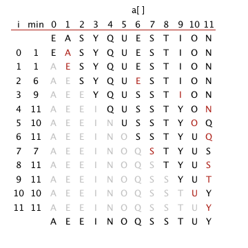
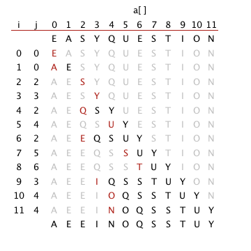

[TOC]

# 2.1初级排序算法

## 练习

1.  插入排序的 `E A S Y Q U E S T I O N`的排序过程

    

2. 在选择排序中，一个元素最多可能交换多少次，平均多少次？

   最多是N次。平均是1次，N个元素交换N次。

3. 倒序数组？

4.  

   ```
   E A S Y Q U E S T I O N
   ```

    

   5. 

   6. 主键相同的情况下，选择排序和插入排序的方法哪个更快？

      插入排序

   7.  

   8. 平方级

   9. 排序轨迹

       

   10. 因为部分有序的时候，插入排序更快。