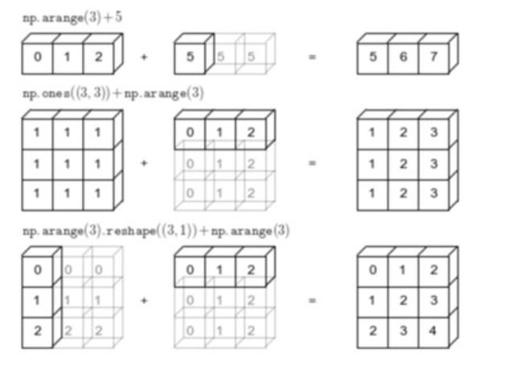

# 高效`numpy`指北

ref:[link](https://speakerdeck.com/cournape/using-numpy-efficiently?slide=19)

## why `numpy`

- 运算高效


## `numpy` 内存结构

- 一块内存区域
- `dtype` 确定了内存区域数据类型
- `metadata` 比如 `shape`、`strides` etc

注：`numpy` 内存占用和 `C` 基本相同，多了常数内存消耗

## `numpy` 广播机制

自动将常数变为可以参与运算的形式

- 无需对常数变成可以进行运算的大小（自动）



**注意：**

- 广播机制是逻辑上的参与运算，并没有创建相应的矩阵（向量）

## indexing

### 数组切片

`[::k]` `k` 是步长

```python
import numpy as np
x = np.arange(6).reshape(2,3)
'''
x=[[0,1,2],
   [3,4,5]]
'''
x[:,::2]
'''
[[0, 2],
 [3, 5]]
'''
x[::2,::2]
'''
array([[0, 2]])
'''
x[:,::-1]
'''
array([[2, 1, 0],
       [5, 4, 3]])
'''
x[::-1,::-1]
'''
array([[5, 4, 3],
       [2, 1, 0]])
'''

```

 简单的index 返回的是原数组的一个view，而非copy

```python
x[::-1,::-1]
'''
array([[5, 4, 3],
       [2, 1, 0]])
'''
>>> x[::-1,::-1][1][1]=120
>>> x
array([[  0, 120,   2],
       [  3,   4,   5]])

>>> c =x[::-1,::-1]
>>> c[0][0]=123
>>> x
array([[  0,   1,   2],
       [  3,   4, 123]])
```

### fancy indexing

fancy index 返回值 通常是一个 copy。

- mask

  ```python
  >>> x = np.arange(6).reshape(2,3)
  >>> x
  array([[0, 1, 2],
         [3, 4, 5]])
  
  >>> mask = x%2==0
  >>> mask
  array([[ True, False,  True],
         [False,  True, False]], dtype=bool
  >>> x[mask]
  array([0, 2, 4])
  ## 测试返回的是copy 而不是 view
  >>> x[mask][0]=122
  >>> x
  array([[0, 1, 2],
         [3, 4, 5]])
  ```

  

- 通过index选择

  ```python
  >>> x = np.arange(6)
  >>> x
  array([[0, 1, 2, 3, 4, 5]])
  >>> indices =[1,2,-1,1]
  >>> x[indices]
  array([1, 2, 5, 1])
  ```

- 

