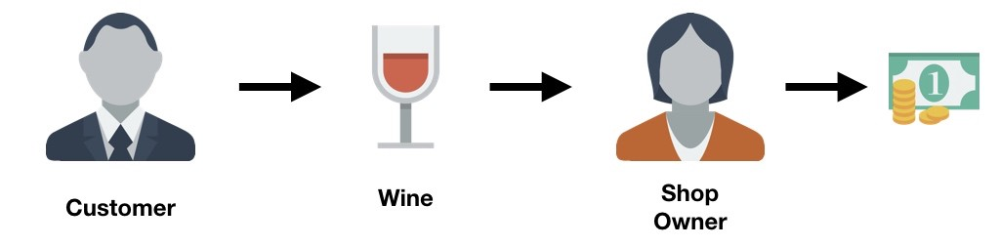

# Demystifying Generative Adversarial Networks

ref: [link](https://towardsdatascience.com/demystifying-generative-adversarial-networks-c076d8db8f44)  注：需要翻墙

这个tutorial 目的在于直观的了解GAN的原理，而无需特别的数学基础。

## 原理介绍

 

这个介绍就讲了一个故事。没有必要写了。需要的自己看吧