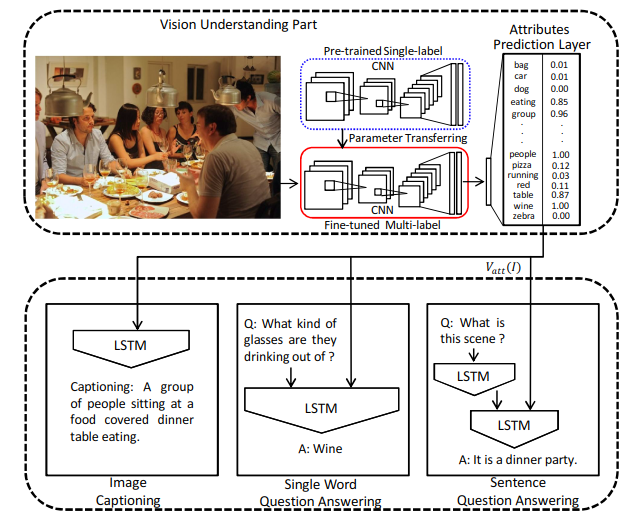
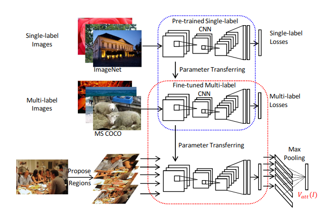

# What value do explicit high level concepts have in vision to language problems?

---

ref:

1. O. Vinyals, A. Toshev, S. Bengio, and D. Erhan. Show and tell: A neural image caption generator. In Proc. IEEE Conf. Comp. Vis. Patt. Recogn., 2014.
2.  M. Ren, R. Kiros, and R. Zemel. Image Question Answering: A Visual Semantic Embedding Model and a New Dataset. In Proc. Advances in Neural Inf. Process. Syst., 2015.
3. 