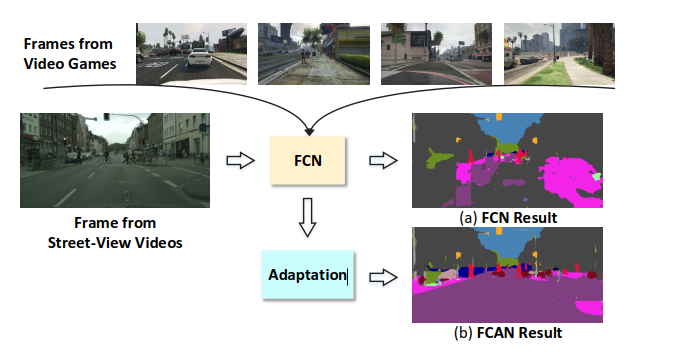
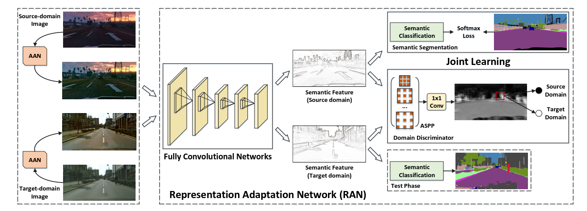
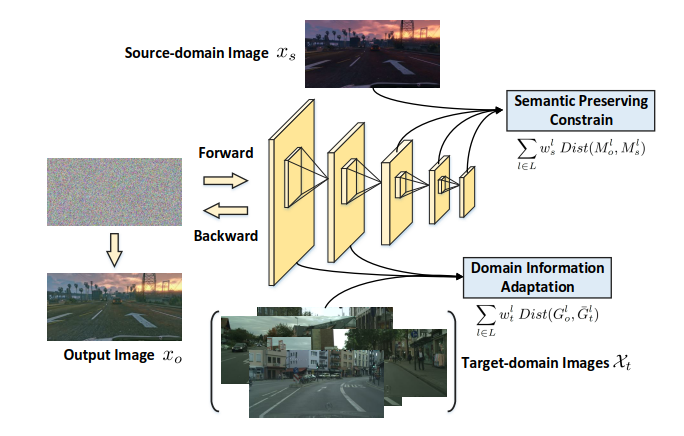

#Fully Convolutional Adaptation Networks for Semantic Segmentation

作者提出了一种 分割迁移网络（FCAN）可以在渲染图和真实图像之间进行迁移。[论文地址](https://arxiv.org/abs/1804.08286)

解决的问题在于从仿真图像的训练模型如何迁移到真实场景下，在此基础上如何利用源域监督信息和大量的无标签的真实图像，来完成模型迁移的任务。

## model

模型结构基本如图所示。主要分为Appearance Adaptation Networks（AAN），和Representation Adaptation Network（RAN）。前者做的事完成输入图像的域转换，源域图像和目标域图像的风格转换。后者是用来学习与域无关的图像分割特征。

## AAN

AAN 目的在于使得来自源域的图像看起来像是来自于目标域。

对于AAN，对于来自源域的一张图片 $x_s$ 和来自目标域的一堆图片 $\mathcal{X}_t=\{x_t^i|i=1,2,...,m\}$。输入为白噪声，将$x_s$迭代渲染成为 目标域风格。（或者说将$x_s$的内容和来自$\mathcal{X}_t$的风格结合起来）

假设 $l$ 层的feature map 有 $N_l$ 个 channel, 每个 channel 的长宽均为 $H_l*W_l$, 则 $l$ 层的 feature map 可以表示为$M^L \in \mathcal{R}^{N_l \times H_l \times W_l}$ 

**content loss**
$$
\min_{x_o}\sum_{l\in L}w_s^l Dist(M_o^l, M_s^l)
$$
其中 $w_s^l$ 是不同层的权重， $Dist()$ 距离采用的是欧氏距离。

**style loss**

style 这里选用的是neural style transfer中的度量， 计算不同feature map上的gram矩阵。
$$
G^{l,ij}=<M^{l,i}, M^{l,j}>
$$
这里 $M^{l,i}$$M^{l,j}$  是 第i，j个向量化以后的feature map。 在论文中，目标域的为多张图片的均值，记为$\bar{G}_t^l$ 

loss 即为
$$
\min_{x_o}\sum_{l\in L}w_t^l Dist(G_o^l, \bar{G}_t^l)
$$
在论文的实验中采用的是`ResNet50`作为基本的CNN的结构。并且使用的是$L=\{conv1, res2c, res3d, res4f,res5c\}$作为风格特征提取输入。

